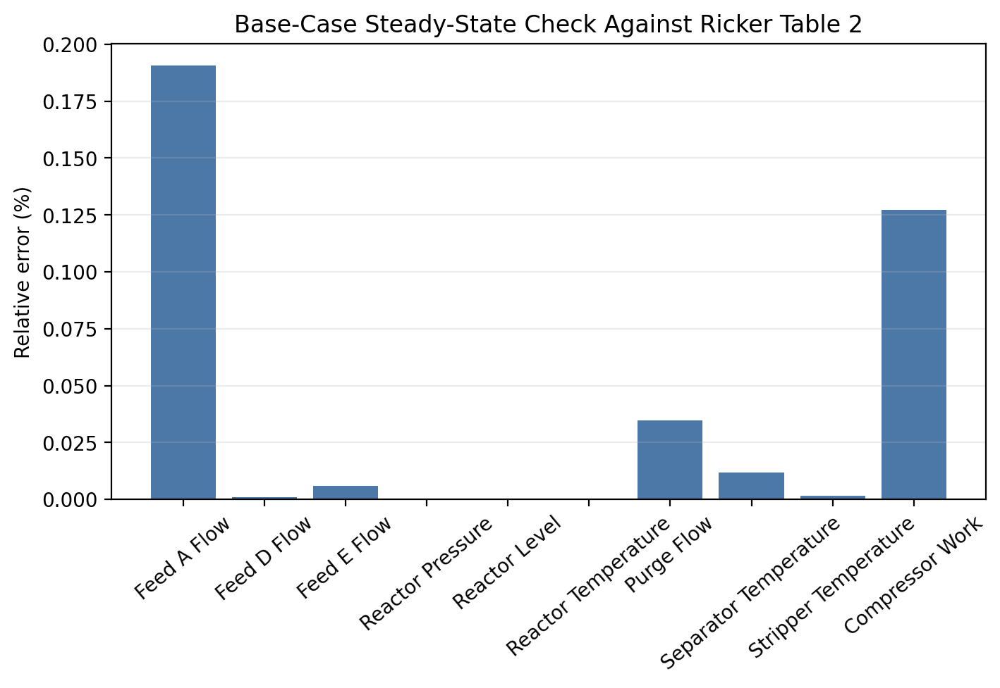
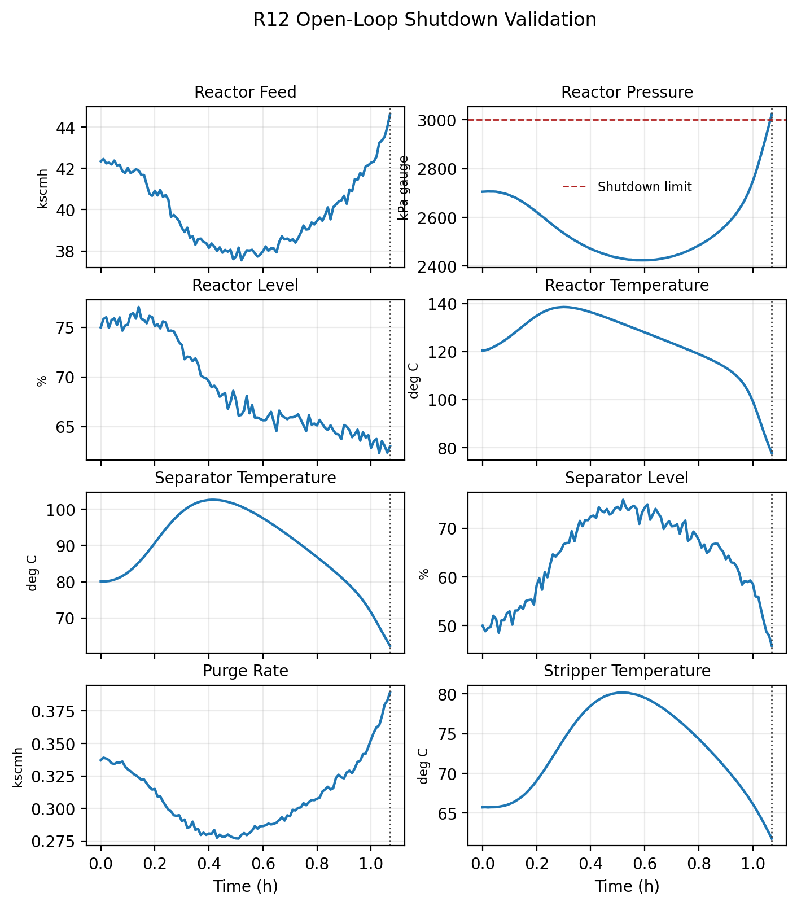
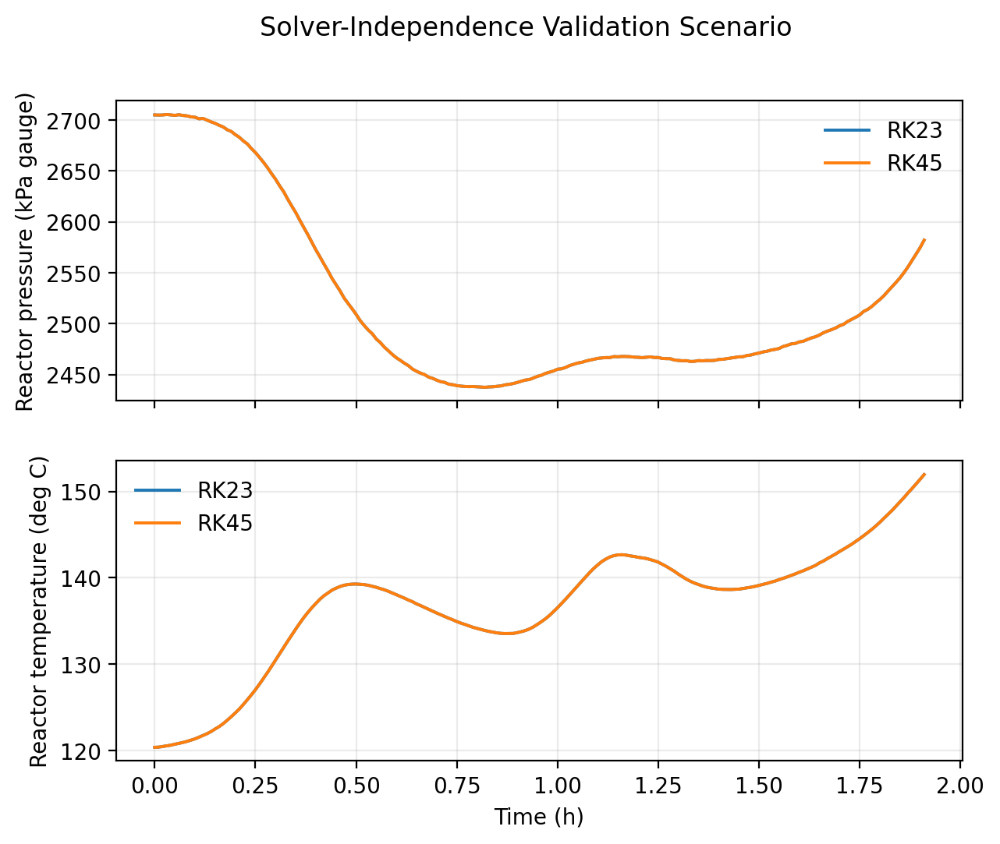
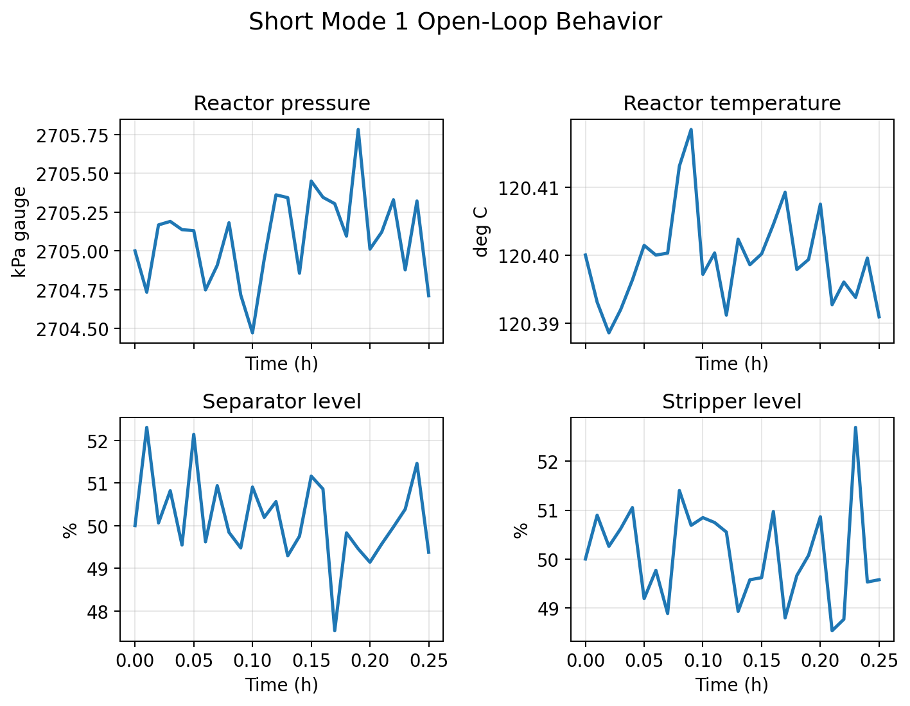

# Validation

The validation layer writes trajectories, metric CSVs, figures, reports, and a manifest under:

```text
src/tep_studio/simulation/validation_outputs/
```

This directory is **generated output** — it is gitignored and not committed. The paths below describe what the validation CLI writes when you run it; run the commands in this guide to (re)generate them. Use validation before relying on simulator outputs in a paper, report, benchmark, or controller comparison.

## 1. Run local validation

```bash
PYTHONPATH=src python3 -m tep_studio.simulation.validation run --suite local
```

This runs short local behavior checks, including normal operation and shutdown behavior.

## 2. Run steady-state validation

```bash
PYTHONPATH=src python3 -m tep_studio.simulation.validation run --suite steady_state
```

This compares the simulator base case against included steady-state references.

## 3. Run MAT-state checks

```bash
PYTHONPATH=src python3 -m tep_studio.simulation.validation run --suite mat_states
```

This evaluates bundled Simulink `CSTATE` vectors for Mode 1, Mode 3, and Skogestad Mode 1 as local operating-point checks.

## 4. Run all validation suites

```bash
PYTHONPATH=src python3 -m tep_studio.simulation.validation run --suite all --solvers RK23 RK45
```

This regenerates validation runs using the requested solvers.

## 5. Generate figures and reports

```bash
PYTHONPATH=src python3 -m tep_studio.simulation.validation figures
PYTHONPATH=src python3 -m tep_studio.simulation.validation report
```

The generated Markdown report is:

```text
src/tep_studio/simulation/validation_outputs/report/validation_report.md
```

## Main artifacts

| Path | Contents |
| --- | --- |
| `validation_outputs/trajectories/` | CSV trajectory files for validation scenarios. |
| `validation_outputs/metrics/` | Metric CSV files for base-case, steady-state, MAT-state, and solver checks. |
| `validation_outputs/figures/` | PNG, SVG, and PDF plots generated from validation outputs. |
| `validation_outputs/report/` | Markdown validation reports and paper-ready report sections. |
| `validation_outputs/manifest.json` | Reproducibility metadata, solver settings, package versions, references, and output paths. |

## Current validation evidence

The latest supplement records the following validation status:

| Check | Current role |
| --- | --- |
| High-precision base-case vector | Completed for 41 measurements and 50 reset states. |
| Rounded steady-state tables | Completed as rounded-table agreement. |
| MAT-state operating points | Completed as local operating-point checks. |
| R12 pressure shutdown | Completed as local shutdown behavior check; shutdown near `1.07 h`. |
| RK23/RK45 solver replay | Completed for the current replay scenarios. |
| Independent transient comparison | Not completed across all modes, disturbances, and shutdown trajectories. |

## Example validation plots

These images are copied from the generated validation artifacts so the documentation can be read without navigating the output tree manually.

### Base-case agreement



### R12 pressure shutdown



### Solver replay



### Short Mode 1 response



## How to read the results

Treat the current validation as strong evidence for the wrapped base case and targeted interface behavior. Do not describe the package as fully validated for all Tennessee Eastman operating regimes unless you add independent transient comparisons with explicit acceptance criteria.

For a release-quality dynamic validation study, add:

- trajectory RMSE;
- maximum absolute error;
- final-value error;
- event-time error;
- shutdown-code agreement;
- stated tolerances before running the comparison;
- independent reference trajectories from an accepted MATLAB, Simulink, or C archive.
